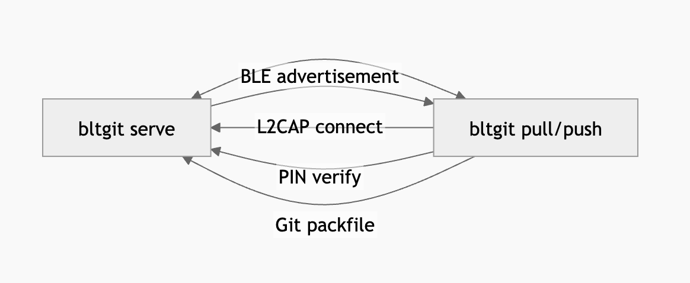

# bltgit

> **Peer-to-peer Git over Bluetooth. Push, pull, and clone repositories between nearby Macs without Wi-Fi, internet, or a server.**

The git transfer tool that works when there's no network. Just Bluetooth.
---


## Features

- **Bluetooth L2CAP channels**: uses CoreBluetooth's direct L2CAP sockets for high-throughput streaming (no BLE GATT overhead)
- **Full Git protocol**: reads and writes real Git packfiles via `git pack-objects` and `git index-pack`; works with any existing repo
- **Push, pull, fetch and clone**: bidirectional; fetch downloads commits into `refs/remotes/bltgit/` without touching the working tree
- **Remote log**: peek at the commit history on another Mac without downloading anything locally
- **Chunked, reliable transfer**: 60 KB chunks with sequence numbers, ACKs, and retry logic survive transient BT glitches
- **Mutual PIN pairing**: first-time connections require both sides to confirm a 6-digit PIN; subsequent connections skip it via a local trust store
- **Non-blocking async I/O**: event-driven stream bridge with no polling loops; the CoreBluetooth RunLoop and async tasks never starve each other

---

## Requirements

- macOS 13.0 or later
- Swift 5.8 or later (`swift build`)
- Bluetooth hardware (built into every Mac)
- `git` on both machines (used for packfile generation and application)

---

## Build

```bash
git clone <this-repo>
cd bltgit-v2
swift build -c release
# Binary is at .build/arm64-apple-macosx/release/bltgit
```

To install system-wide:
```bash
sudo cp .build/arm64-apple-macosx/debug/bltgit /usr/local/bin/bltgit
```

For a quick test without installing, you can also just run the debug build:
```bash
swift build
.build/arm64-apple-macosx/debug/bltgit --help
```

---

## Usage

### Serve a repository

Run this in the directory you want to share:

```bash
bltgit serve
# Serving repo at /path/to/your/repo...
```

The Mac will advertise itself over Bluetooth and wait for connections. It handles both incoming `pull` and `push` requests.

---

### Discover nearby devices

```bash
bltgit discover
# Found: <DEVICE_NAME>  <UUID> RSSI: -52 dBm
```

---

### Clone a remote repo

```bash
bltgit clone "<DEVICE_NAME>" ./my-project
# or use the UUID from discover:
bltgit clone <UUID> ./my-project
```

On first connection you will be asked to confirm a PIN displayed on the other Mac. After pairing, subsequent connections are automatic.

---

### Pull new commits

```bash
# Inside an existing bltgit-cloned repo:
bltgit pull "<DEVICE_NAME>"
```

---

### Fetch

Download new commits into `refs/remotes/bltgit/` without touching your working tree:

```bash
bltgit fetch "<DEVICE_NAME>"
# Fetch complete.
#   refs/remotes/bltgit/main
#
# To inspect:  git log refs/remotes/bltgit/main
# To merge:    git merge refs/remotes/bltgit/main
```

Useful when you want to review what changed before committing to a merge.

---

### Push commits

```bash
bltgit push "<DEVICE_NAME>"
```

---

### View remote commit history

See the last 20 commits on another Mac without pulling anything:

```bash
bltgit log "<DEVICE_NAME>"
# Commit log for <DEVICE_NAME>:
# ------------------------------------------------------------
# abc1234  Jane Doe  3 hours ago  Fix scanner timeout
# def5678  Bob Smith  1 day ago   Add chunked transfer retry
# f1a2b3c  Jane Doe  2 days ago   Initial commit
```

---

### Manage trusted devices

```bash
bltgit devices
# Trusted devices:
#   "<DEVICE_NAME>" (<UUID>) paired Jun 2, 2026
```

---

## How it works




1. **Discovery**: the server publishes a BLE advertisement containing a CoreBluetooth L2CAP PSM (channel number) in a GATT characteristic.
2. **Connection**: the client reads the PSM and opens a direct L2CAP socket, bypassing the GATT overhead for raw byte streaming.
3. **Pairing**: both sides exchange a SHA-256 hash of a 6-digit PIN; the trust result is saved to `~/.config/bltgit/trusted_devices.json`.
4. **Transfer**: Git packfiles are split into 60 KB chunks, each with a sequence number and ACK; the receiver reassembles and passes the result to `git index-pack`.
5. **Ref update**: after a successful pack import, refs are updated with `git update-ref` and the working tree is checked out.

---

## Known limitations

- Push always targets `refs/heads/main` (current branch resolution not yet implemented)
- Large repos (>100 MB pack) will be slower than Wi-Fi but work reliably
- macOS only; iOS does not support L2CAP server mode in CoreBluetooth
